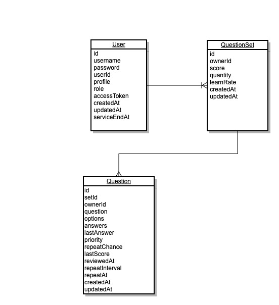

# Spaced Repetition Server

## Database
Collection:
* User
* QuestionSet
* Question

Explain:

* Only user can create a QuestionSet
* Only owner can edit QuestionSet and Question
* Only owner can use spaced repetition feature for a Question
* Each question can only be in one QuestionSet
* Question and QuestionSet can be private or public

Diagram:

## API
* /question
  * POST content-JSON
    
    Create question
* /question/check
  * POST content-JSON
    
    Check answer and set review date

* /question/{question_id}    
  * GET
    
    Retrieve a question byy question_id
    
  * PATCH content-JSON
    
    Modify a question
    
  * PUT content-JSON
    
    Modify all fields in a question
    
  * DELETE
    
    Delete a question
    
* /learnList
    * POST content-JSON
    
      Create a QuestionSet
* /learnList/{set_id}
    * GET

      Retrieve a question set by set_id

    * PATCH content-JSON

      Modify a question set

    * PUT content-JSON

      Modify all fields in a question set

  * DELETE

    Delete a question set and (Optional)questions belong to the set
        
    

